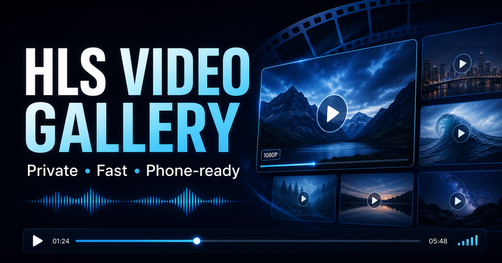

# HLS Video Gallery

A self-hosted, private video library for ordinary Apache servers. Drop source
videos into one directory and the gallery builds a searchable catalog, cached
10-second thumbnails, and phone-compatible HLS streams automatically.



The package has no database and no frontend build step. Branding, paths, colors,
access control, encoding, content tags, and optional CDN behavior live in one
JSON configuration file. The included taxonomy and default installation are
neutral and work for any private video archive.

## What it includes

- H.264/AAC HLS playback with vendored hls.js for broad phone and laptop support.
- One configurable rendition, up to 1080p by default, without upscaling.
- A single FFmpeg decode feeding both HLS and the thumbnail timeline.
- Source-aware caching: unchanged videos are never re-encoded.
- Automatic removal from the catalog when a source disappears; stale cache output
  is retained briefly for safety and then cleaned.
- Search, 10-item paging, multiple sorts, duration filters, filename hints,
  optional visual tags, previous/next navigation, and filtered shuffle.
- Source video/audio metadata, creation and modified dates, stream details, and
  a visual timeline.
- Live web and terminal telemetry for queue position, FPS, speed, ETA, current
  thumbnail, sanitized FFmpeg parameters, and the active command.
- Apache Basic Auth with bcrypt password hashes outside the document root.
- An optional public teaser page that does not expose the catalog.
- Optional Bunny Storage/CDN sync, signed delivery, and one-video guest links.
- systemd services and timers with conservative permissions and load priorities.

## Supported hosts

The automated dependency installer supports:

- AlmaLinux 9/10 and Rocky Linux 9/10.
- Debian and Ubuntu releases that provide systemd, Apache, PHP, and FFmpeg.

The AlmaLinux/Rocky path enables CRB, EPEL, and RPM Fusion, following the
[AlmaLinux multimedia guidance](https://wiki.almalinux.org/series/system/SystemSeriesA06.html)
and the [RPM Fusion Enterprise Linux repository](https://download1.rpmfusion.org/free/el/).
Debian/Ubuntu use the distribution
[FFmpeg package](https://packages.debian.org/search?keywords=ffmpeg).

Other systemd-based distributions can work if you install these requirements
yourself:

- Apache 2.4 with `.htaccess`, rewrite, headers, Basic Auth, and authn-file support.
- PHP 7.4 or newer.
- Python 3.8 or newer.
- FFmpeg/ffprobe with `libx264`, AAC, scale, MJPEG, and HLS support.
- OpenSSL and `htpasswd`.

## Quick start

Run these commands on the destination server:

```bash
git clone https://github.com/YOUR-ACCOUNT/hls-video-gallery.git
cd hls-video-gallery

sudo ./scripts/install-dependencies.sh

cp config/gallery.example.json config/gallery.json
cp config/users.example config/users.txt
nano config/gallery.json
nano config/users.txt

sudo ./scripts/install.sh
```

At minimum, change:

- `instance_id`
- `install.document_root`
- `install.owner`
- `site.public_base_url`
- `site.main_site_url`
- every string in `brand`
- the placeholder username and password in `config/users.txt`

Then copy or upload videos into the printed `Media directory`. The scan timer
notices stable files, processes one at a time, and publishes each completed video
without waiting for the entire queue.

```bash
cp my-video.mp4 /var/www/html/videos/media/
hls-gallery-status-my-video-gallery --watch
```

The `instance_id` is part of every systemd unit and status command, so multiple
independent galleries can coexist on one server.

## Before installing

The Apache virtual host must allow the gallery’s `.htaccess` rules. A typical
Apache configuration is:

```apache
<Directory "/var/www/html/videos">
    AllowOverride All
    Require all granted
</Directory>
```

The public URL must already have a valid HTTPS certificate. If a reverse proxy
terminates TLS, it should send `X-Forwarded-Proto: https`.

Validate configuration and dependencies at any time:

```bash
./scripts/validate.sh
sudo ./scripts/doctor.sh --config config/gallery.json
```

## Updating

The installer is also the updater:

```bash
git pull --ff-only
sudo ./scripts/install.sh
```

Runtime media, catalogs, analysis results, and caches are preserved. If encoding
settings or the pipeline format changes, one rebuild marker is created and each
source is regenerated exactly once. Branding-only changes do not re-encode media.

## Common operations

```bash
# Browser-equivalent status in the terminal
hls-gallery-status-my-video-gallery --watch

# Include the full current queue and active FFmpeg command
hls-gallery-status-my-video-gallery --watch --all --command

# Follow encoder logs
journalctl -fu hls-gallery-my-video-gallery-scan.service

# Run a scan now
systemctl start hls-gallery-my-video-gallery-scan.service

# Add or replace a login without saving a plaintext password
sudo ./scripts/add-user.sh viewer

# Preview unused generated cache directories
sudo -u www-data /var/www/html/videos/_tools/cleanup_cache.py --dry-run

# Remove only unused generated cache directories
sudo -u www-data /var/www/html/videos/_tools/cleanup_cache.py
```

See [Operations](docs/OPERATIONS.md) for service names, logs, cache semantics,
backups, and troubleshooting.

## Optional visual tags

Visual analysis is off by default. It reads the already-generated thumbnails; it
does not decode each source video a second time. Enable it in `gallery.json`, run
the main installer, and then install the model runtime:

```bash
sudo ./scripts/install-analyzer.sh
```

The model is intentionally low-priority and waits while FFmpeg is active or the
configured load ceiling is exceeded. Detections and filename hints are displayed
separately because neither should be treated as human-reviewed fact.

## Optional Bunny CDN and share links

Set `cdn.provider` to `bunny`, copy `config/bunny.example.env` to
`config/bunny.env`, and fill in the Storage Zone and Pull Zone values. Public
one-video links additionally require Bunny token authentication and correct CORS.

The web page obtains short-lived signed CDN paths at playback time. CDN secrets
are never written into public JavaScript or the catalog.

Follow [Bunny CDN setup](docs/BUNNY_CDN.md) before enabling
`access.public_share_links`.

## Repository layout

```text
config/       owner configuration examples, taxonomies, ignored secrets
docs/         deployment and operations guides
presets/      general-purpose starting configuration
scripts/      validation, dependency, install, user, analyzer, and release tools
site/         source templates and runtime application
systemd/      rendered per-instance service and timer templates
```

More detail is in [Configuration](docs/CONFIGURATION.md),
[Operations](docs/OPERATIONS.md), and [Security](SECURITY.md).

## Publishing to GitHub

This directory is ready to be a normal Git repository:

```bash
git remote add origin git@github.com:YOUR-ACCOUNT/hls-video-gallery.git
git push -u origin main
```

Real configuration, plaintext bootstrap users, CDN credentials, media, generated
data, and release files are ignored. Run `scripts/package-release.sh` after a
commit to create a source archive, a cloneable Git bundle, and SHA-256 checksums
in `dist/`.

The bundle preserves history and branches:

```bash
git clone hls-video-gallery-1.0.0.bundle hls-video-gallery
```

## License

The application code is MIT licensed. The vendored hls.js distribution retains
its own license notice in `site/assets/hls-LICENSE.txt`. Optional model packages
and weights have their own upstream licenses; review them before redistribution.
